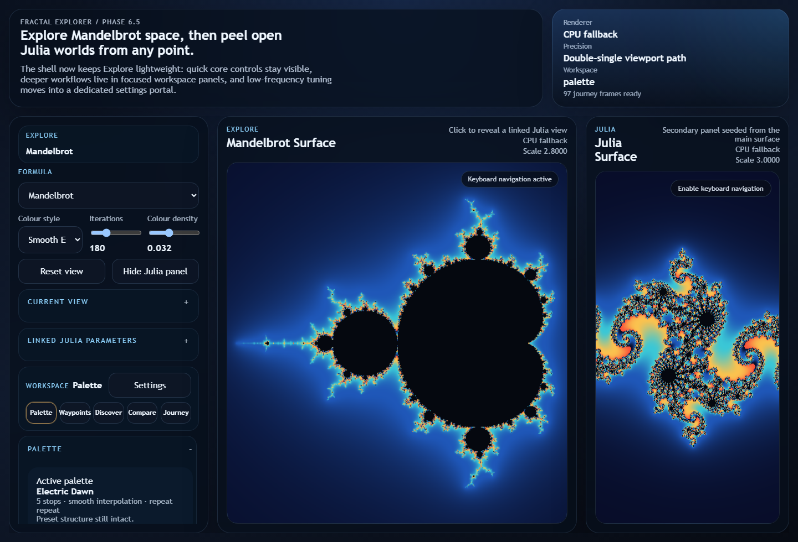
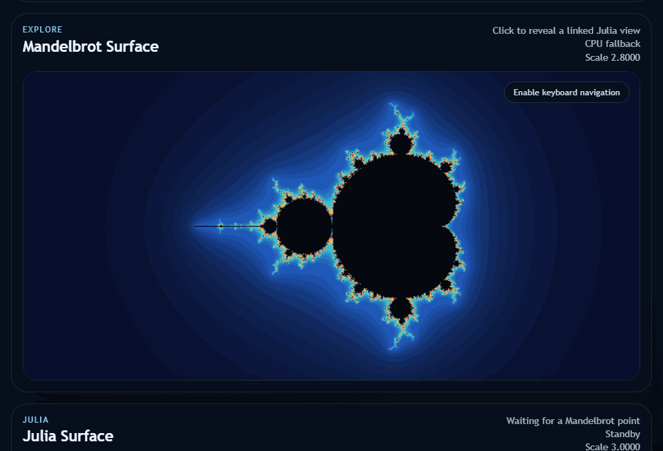
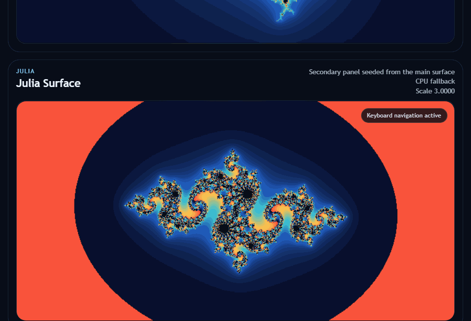
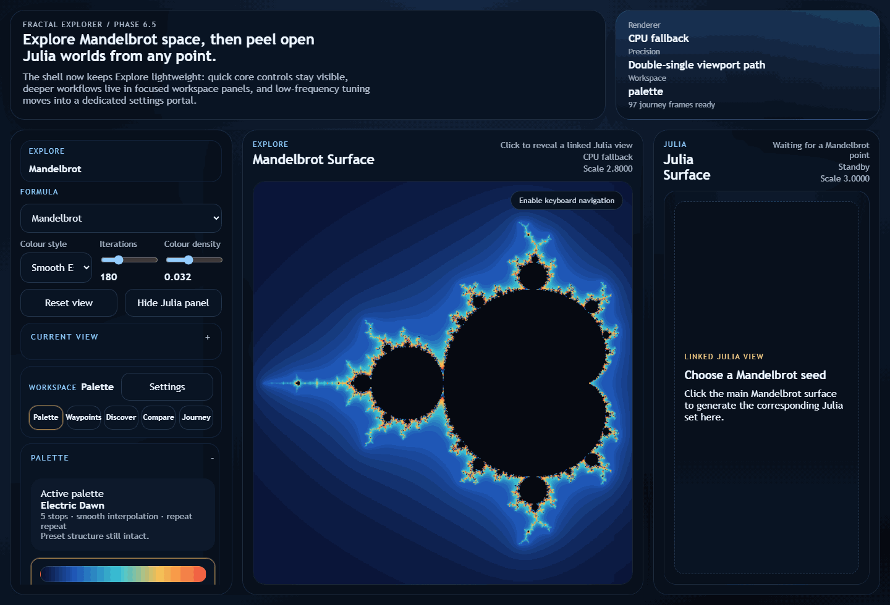
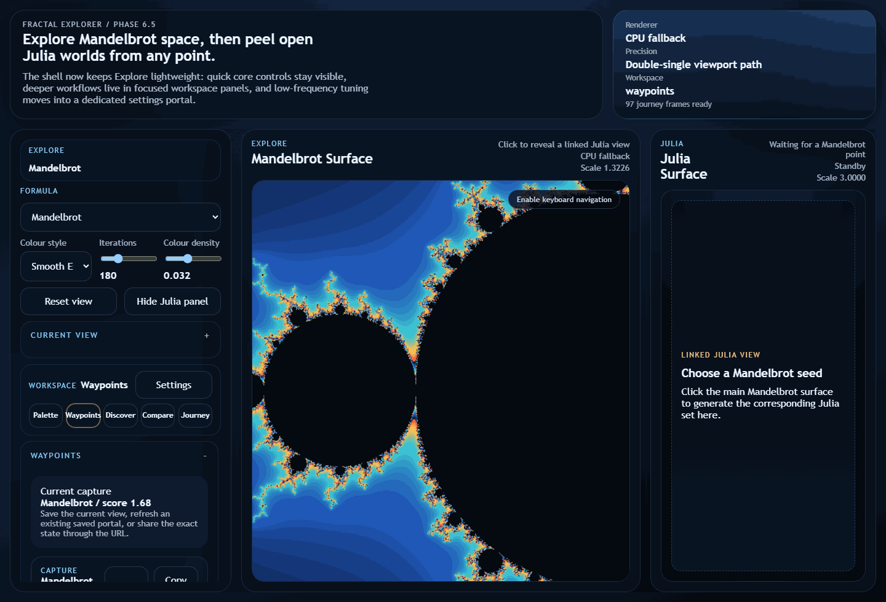
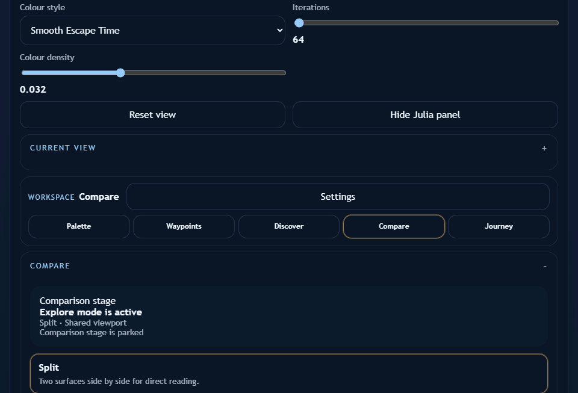
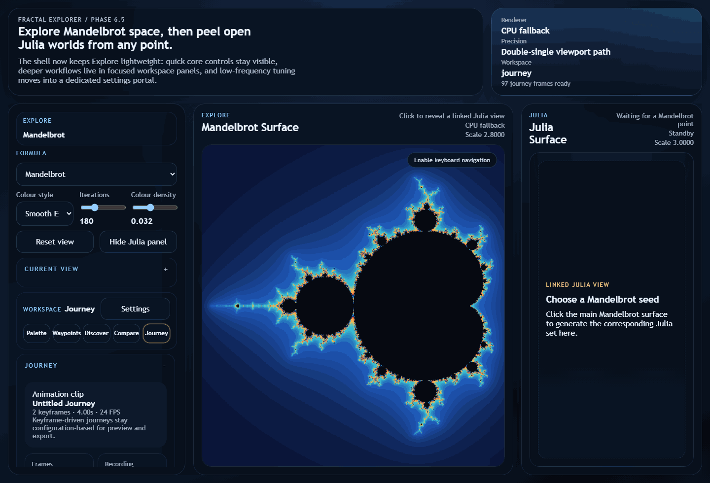
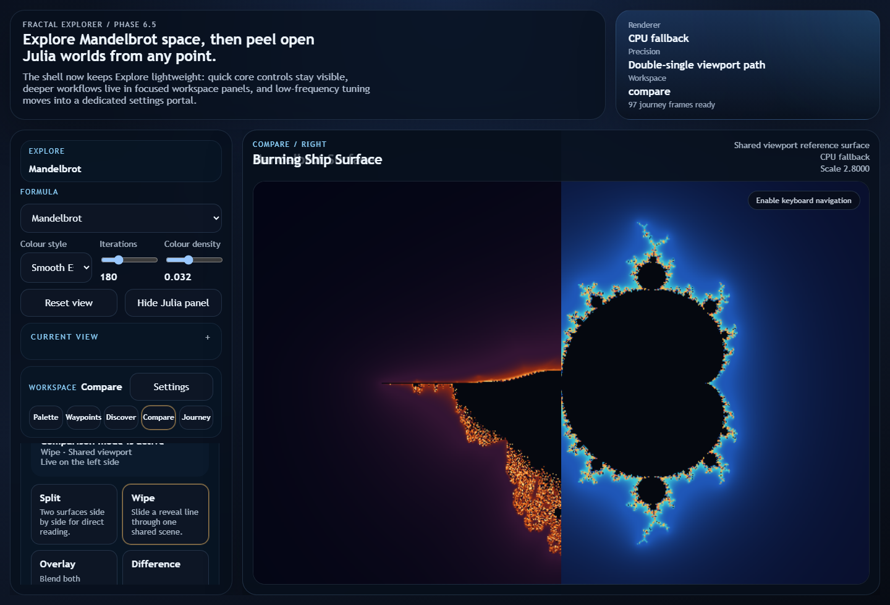

# Fractal Explorer

Fractal Explorer is a WebGPU-first browser laboratory for travelling through
Mandelbrot, Julia, Burning Ship, Tricorn, Multibrot, Newton/Nova and Phoenix landscapes. It pairs direct
navigation with focused tools for palettes, Waypoints, discovery, comparison,
and keyframed journeys.





[Watch the Julia keyboard-tuning demo (WebM)](docs/demo/julia-keyboard.webm)











## Highlights

- Explore with drag, scroll, and configurable game-style keyboard controls.
- Click a Mandelbrot point to seed its corresponding Julia set.
- Shape palettes with an interactive curve editor and reusable presets.
- Save shareable Waypoints, scan for interesting structures, and revisit them.
- Compare formulas and configurations using split, wipe, overlay, or difference views.
- Author deterministic journeys between configurations and export image sequences or WebM.
- Render through WebGPU with a shared CPU fallback for unsupported environments.



## Quick start

Install dependencies once, then start the local app:

```sh
npm install
make dev
```

Open the URL Vite prints, normally `http://localhost:5173`.

If `make` is unavailable on your platform, use the equivalent npm command:

```sh
npm run dev
```

## Commands

| Command | Purpose |
| --- | --- |
| `make dev` | Start the Vite development server. |
| `make build` | Type-check and build the production bundle. |
| `make test` | Run unit tests. |
| `make e2e` | Run browser regression tests. |
| `make demo` | Regenerate the README demo screenshots. |
| `make demo-video` | Capture Julia keyboard-tuning GIF and WebM demos (requires the local app). |
| `make demo-explore` | Capture Explore navigation GIF and WebM demos (requires the local app). |
| `make demo-palette` | Capture palette-preset GIF and WebM demos (requires the local app). |
| `make demo-waypoint` | Capture Waypoint GIF and WebM demos (requires the local app). |
| `make demo-compare` | Capture Compare GIF and WebM demos (requires the local app). |
| `make demo-journey` | Capture Journey GIF and WebM demos (requires the local app). |
| `make check` | Run TypeScript type-checking only. |

The same commands are also available through `npm run ...` where applicable.

## Product model

Explore and Perform share the same Primary world. Explore retains its focused editing tools:

- **Explore** keeps formula, camera, color, and navigation controls close to the canvas.
- **Visual Lab and Palette** shape materials, lenses and palette curves.
- **Waypoints** records complete serializable render configurations for reliable revisits and sharing.
- **Discover** searches the active region for promising boundary structures.
- **Compare** reads two configurations through shared or independent viewpoints.
- **Journey** builds deterministic, keyframed movement through fractal space.

Render configurations carry versioned viewport, formula, colouring, palette, and quality data. That common shape is reused by URLs, Waypoints, comparisons, animation frames, and exports.

### Try the first Perform slice

Choose a Phoenix view in Explore, open **Perform**, then **Add palette wave → Play internal motion**. Palette offset and Orbit memory are temporary live controls: **Return to modulation** releases a held value; **Stop and edit base** restores your authored world. Pause/Resume and workspace switches preserve logical time. Compare focus never changes the Primary target.

While stopped, inspect the numbered mappings and their source/smoothing settings. Source edits affect every mapping that shares that source. Save a static live frame through Waypoints, or use **Save base configuration** to keep authored motion definitions. The Hydrasynth controls can also record and replay a separate local controller take; see [the take contract](docs/PERFORMANCE_TAKES.md). Macros, freeze, promotion and saved pin layouts remain future work; see [the Perform findings](docs/PERFORM_FINDINGS.md) for remaining work and actual-use review questions.

## Development notes

WebGPU is the primary renderer and uses a double-single viewport coordinate path for deeper zoom precision. The CPU renderer preserves the same formulas, palettes, colouring, and exploration model when WebGPU cannot start, although it is intentionally slower.

The committed screenshots and clips are generated only by the dedicated capture scripts, while browser regression tests verify the same entry flows without writing documentation assets. All of them begin from the same serialised demo render configuration. Regenerate README screenshots with `make demo`, then review the resulting images before committing. Capture the animated Explore, Julia, Palette, Waypoint, Compare, and Journey flows with `make demo-explore`, `make demo-video`, `make demo-palette`, `make demo-waypoint`, `make demo-compare`, and `make demo-journey` while the app is running; set `FRACTAL_DEMO_URL` if it is not using port 4173.

See [the product brief](docs/PRODUCT_BRIEF.md), [architecture](docs/ARCHITECTURE.md), and [roadmap](docs/ROADMAP.md) for the fuller product and engineering direction.

## License

Fractal Waypoints is available under the GNU Affero General Public License v3.0 or later (`AGPL-3.0-or-later`). You may use it personally, academically, artistically, professionally or commercially, and study, modify and redistribute it, subject to the licence's terms. The AGPL is a strong copyleft licence and includes additional requirements relevant to modified software made available over a network; review the licence itself for details and seek independent legal advice for questions about a particular use.

If you need different or proprietary terms, a separate commercial licence may be available by agreement with the project owner, Schnock Art. See [LICENSE](LICENSE) for the open-source licence, [COMMERCIAL_LICENSE.md](COMMERCIAL_LICENSE.md) for that route, and [CONTRIBUTING.md](CONTRIBUTING.md) for contribution guidance. Third-party dependencies and materials remain governed by their respective licences. Repository-authored documentation, examples and project assets are covered by the AGPL unless identified otherwise.

The software licence does not transfer ownership of the Fractal Waypoints project name, logos, or other project branding.

Copyright © 2026 Schnock Art.
