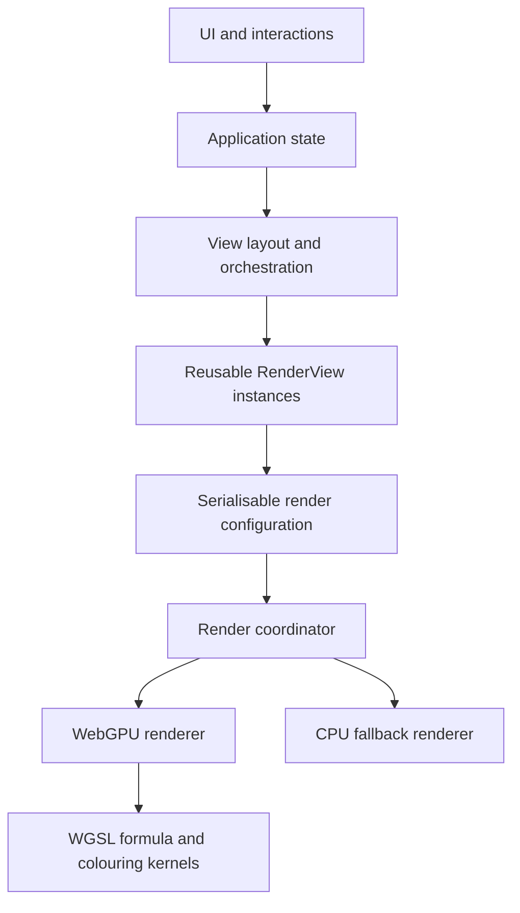

# Fractal Explorer — Architecture

## System boundary



The renderer consumes configurations. It should not know whether a configuration came from an editor, Waypoint, animation frame, URL, or discovery engine.

## Suggested source layout

```text
src/app/             Application composition and state
src/math/            Double-single and complex arithmetic
src/fractals/        Formula definitions and registry
src/colouring/       Colouring algorithms and registry
src/palettes/        Palette model, interpolation, editor logic
src/rendering/       Render coordinator, WebGPU, CPU fallback
src/navigation/      Viewport controls, keyboard movement, Waypoints, discovery
src/comparison/      Synchronized and independent render views
src/animation/       Keyframes, interpolation, frame generation
src/persistence/     URL, project JSON, still/video export
src/components/      UI components only
tests/               Math, palettes, navigation, animation, persistence
```

## Render view composition

`RenderView` is the reusable visual unit for one fractal surface. It should own:

- a `RenderConfig` describing what to render
- an interaction controller for pan, zoom, and point selection
- a configurable navigation-input layer for pointer and keyboard actions
- a canvas or surface binding plus render lifecycle hooks
- optional viewport synchronisation hooks for linked views

Higher-level layout state decides whether one or more render views appear as:

- a single Explore surface
- an Explore surface plus a Julia secondary panel
- a comparison arrangement such as split, wipe, difference, or overlay

`RenderView` should not know whether it is the primary view, a Julia preview, or one side of comparison. That distinction belongs to layout and orchestration code.

## Workspace shell composition

The application shell should separate three layers of control:

- always-on Explore essentials for the active surface, such as formula choice, iteration depth, colour density, reset actions, and current-view guidance
- one focused workflow panel at a time for `Palette`, `Waypoints`, `Discover`, `Compare`, or `Journey`
- a dedicated settings portal for low-frequency global controls such as key bindings, navigation tuning, diagnostics, and quality knobs

This keeps the main canvas visually primary while still allowing each workflow to grow in depth without turning the sidebar into a permanently expanded inspector. Future panels should plug into the same workspace-switcher model rather than being appended to the Explore essentials stack.

## Domain model

`RenderConfig` contains `schemaVersion`, `viewport`, `fractal`, `colouring`, `palette`, and `quality`.

`NavigationSettings` contains schema versioned input bindings and movement parameters such as pan speed, zoom speed, rotation speed, and optional precision or boost modifiers. It should remain serialisable so user preferences and future presets can be stored and restored cleanly.

`ViewportConfig` contains a double-single complex `centre`, `scale`, `rotation`, and `aspectRatio`.

`FractalConfig` contains `formulaId`, numeric `parameters`, `maxIterations`, and `bailout`.

`ColouringConfig` contains `algorithmId` and numeric `parameters`.

`PaletteConfig` contains ordered colour stops, interpolation mode (`linear`, `smooth`, or `cubic`), repeat mode (`clamp`, `repeat`, or `mirror`), offset, and scale.

`Waypoint` contains `schemaVersion`, `id`, name, optional description, complete `RenderConfig`, tags, source (`curated`, `discovered`, or `user`), and optional interestingness score.

## Double-single arithmetic

Represent a scalar as `{ hi: number, lo: number }`; represent complex values as one such pair for the real component and one for the imaginary component. Provide matching CPU and WGSL operations for add, subtract, multiply, divide, square, absolute-square, and complex arithmetic.

Coordinate mapping must be separate from formula evaluation:

```text
pixel → viewport-relative offset → double-single complex coordinate
      → formula iteration → colouring result → palette sample
```

Use ordinary `f32` for local pixel offsets and colours where appropriate, but viewport centres and accumulated complex coordinates must use the double-single path.

## Navigation and input

Navigation should be separated into:

- viewport math that transforms movement intents into updated `ViewportConfig` values
- input mapping that converts pointer, wheel, keyboard, and future gamepad events into semantic navigation actions
- movement settings that define bindings, acceleration, repeat behaviour, and sensitivity

This separation keeps keyboard movement configurable without coupling key bindings to rendering code or UI components. `RenderView` consumes navigation actions; it should not hardcode specific keys such as `W`, `A`, `S`, or `D`.

## Formula and colouring interfaces

Each formula has an `id`, display name, parameter definitions, and supported colouring capabilities. The current baseline set is Mandelbrot, Julia, Burning Ship, and Tricorn. Later candidates include Multibrot, Newton, orbit traps, distance estimation, and custom formulas.

Colouring algorithms remain modular and serialisable. The current colouring set includes classic smooth escape-time shading plus orbit-trap colouring, with the default orbit-trap presentation blending trap accents over escape-time structure so boundary exploration stays readable. Algorithm-specific numeric parameters stay in `ColouringConfig.parameters` so Explore, Compare, Waypoints, Journey, and persistence can all reuse the same render configuration shape.

## Palette architecture

`PaletteEditorState → PaletteConfig → CPU sampler / GPU lookup representation`.

The editor must not depend on a formula. A visual preset is simply a name plus colouring and palette configurations.

## Comparison

`ComparisonConfig` contains independent left and right `RenderConfig` values, a mode (`split`, `wipe`, `difference`, or `overlay`), and a `synchroniseViewport` flag. Synchronised comparison uses one screen-to-complex mapping while formula, colouring, palette, and quality remain independent.

Comparison should compose reusable `RenderView` instances plus layout and interaction policy instead of introducing a separate renderer-specific code path. The same abstraction should support the earlier Julia secondary-panel experience.

## Animation

Animations contain a schema version, duration, easing, and ordered keyframes. Each keyframe stores a time and `RenderConfig`. Zoom interpolates logarithmically; exported frames are deterministic and independent of display refresh rate.

## Persistence

Support URL state for one shareable `RenderConfig`, project JSON for palettes/Waypoints/scenes/animations, and exported images/video. Every persisted structure needs a schema version and migration boundary.

## Diagnostics

Diagnostics should cover both renderer startup and active-view health. Startup diagnostics explain why WebGPU is or is not available, while deep-zoom diagnostics inspect the active `RenderConfig` and report when the current zoom depth is likely to need more iteration headroom or future perturbation-based rendering support.

The renderer-selection layer should also expose a real CPU fallback behind the same `RenderCoordinator` interface. WebGPU remains primary, but unsupported or failed GPU startup paths should still produce an interactive surface that consumes the same `RenderConfig` and reports that fallback mode clearly through diagnostics. The CPU path may use an adaptive internal render resolution and cancel stale frames between row batches, prioritising responsive exploration over matching WebGPU pixel density exactly.
