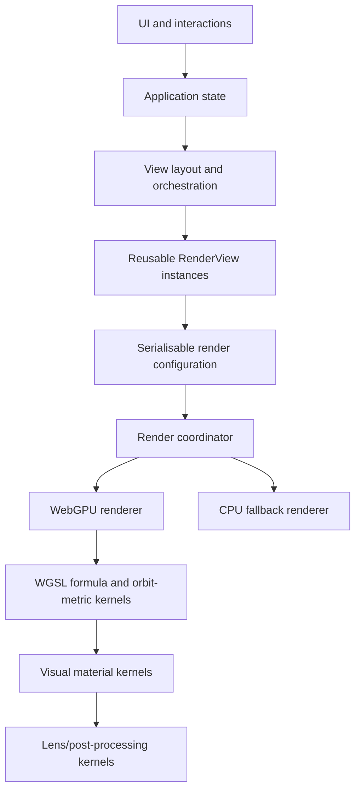

# Fractal Explorer — Architecture

Multibrot extends the formula registry with a normalised power parameter (2–8, default 3). The CPU helper lives in `src/fractals/multibrot.ts`; WebGPU packs power into `render.detail.y` and evaluates integer powers in double-single arithmetic or fractional powers via principal-branch f32 exponentiation. Both direct and metric-field paths use power-aware smooth iteration. Explore and Compare share `MultibrotControls`; URL/Waypoint configurations and Journey interpolation retain the parameter without a new schema shape. Fractional powers have a branch seam and are not a deep-zoom precision guarantee.

## System boundary



The renderer consumes configurations. It should not know whether a configuration came from an editor, Waypoint, animation frame, URL, or discovery engine.

## Standalone instrument and future external signals

Fractal Waypoints is independently useful, with room to become a peer in a larger generative system. Future hardware/software adapters must address semantic domain parameters and produce effective `RenderConfig` values; formulas, materials, and renderers remain unaware of MIDI, audio, synths, music generation, or node graphs. Signals, events, and persistent state require distinct semantics. A future node editor is a view over an independent domain model, not the architecture itself.

Preserve the order: persisted/base configuration → Journey/keyframes → modulation or future inputs → domain normalisation/validation → effective configuration → renderer. Phase 10.2 separates `sampleAnimationBase` from `evaluateConfiguration`, composing domain helpers in `normalizeEvaluatedConfig` after a single modulation application. Live Journey and export share this explicit-time path. Import repair and target-command rejection remain separate; this is a current typed-frame boundary, not an external-input runtime or universal JSON schema validator. [MODULATION_EVALUATION.md](MODULATION_EVALUATION.md) specifies the limited source/transform/mapping model.

Formula metrics can later feed independent statistical analysis and export without colour or musical interpretation. The GPU metric-field texture is a lossy material intermediate, not a public metric contract. See [ADR-026](DECISIONS.md#adr-026-external-control-and-generative-interoperability) and [the interoperability audit](INTEROPERABILITY.md) for semantic addressing conventions, output boundaries, current limitations, and post-9.3 decisions. No external integration dependencies are introduced.

## Workspace direction — One world, different benches

Explore and the first Perform slice are workspaces over the same mathematical world (ADR-028); Patch remains future work. They share domain parameters and `RenderConfig`, formula/metric/material/lens evaluation, Waypoints, Journey, modulation, rendering and existing persistence. A workspace changes the tools presented, not the underlying model or backend. Explicit Compare views and Julia previews remain legitimate independent views; switching workspaces does not create another copy of Primary.

Explore investigates and configures with the existing product language. Perform presents pinned immediate controls, inspectable macros, active modulation values, triggers, recording, and safe restoration. Patch later edits relationships over an independently validated serialisable model; it must not be required to play. These roles describe the committed direction, not current UI capabilities.

### Current implementation and completed Phase 10.0 design

`src/app/workspaceModes.ts` defines the six focused Explore tools. `App.tsx` owns the Explore/Perform selection, authored `mainConfig`, explicit comparison configurations, captured Journey clip, shared preview clock and two-target session overrides. Internal playback evaluates Primary directly; Journey first samples its captured clip. Overrides use existing semantic writers and final validation. Only authored changes update the URL. Primary resize is presentation-local, even stopped; its canvas/surface survives workspace switches. Primary callbacks own viewport only and are guarded outside stopped Explore. `PerformPanel` edits the one canonical program, while `performance/model.ts` handles validation, mapping-order changes and bounded overrides. The evaluator returns ordered mapping diagnostics rather than the UI guessing failure status. See [PERFORM_FINDINGS.md](PERFORM_FINDINGS.md); persistent performance setup and takes do not exist yet.

The [Phase 10.0 design](WORKSPACE_DESIGN.md) is complete; these decisions describe the target implementation, not features already shipped. ADR-029 records authored/effective ownership and explicit Primary scope.

| Responsibility | Constraint | Phase 10.0 decision |
| --- | --- | --- |
| Mathematical world | Shared domain model, not one clone per workspace | Separate authored base and effective output; Perform targets Primary, with explicit promotion from Compare/Julia |
| Performance setup | Semantic controls and mappings, separate from mathematical meaning | Save pins/macros and mapping references with project/setup data; shared transient transport survives workspace switches |
| Ephemeral UI | Layout and selection must not define domain identity | Remember Explore tool locally; global settings/activity controls; focus never retargets performance |
| Persistence | Versioned, reproducible data; preserve existing saved views | Address bar follows base; labelled visible-frame captures bake motion; future project/take formats versioned; recovery starts stopped |
| Workflow placement | Preserve Visual Lab, palette editing, Waypoints, Discover, Compare, Journey | Six tools remain within Explore; Perform is a peer workspace; Patch hidden until intentionally implemented |

Acceptance walkthrough: discover Phoenix, save a Waypoint, enter Perform on the same world, pin Orbit memory and palette controls, modulate and record. A future Patch change can replace the internal source with hardware without reconstructing the fractal. Hardware and graph portions are future design checks, not Phase 10 runtime scope.

Phase 10.1 incrementally supplies semantic metadata; 10.2 evolves internal modulation and final domain validation; 10.3 delivers Perform; 10.4 establishes capability-aware analysis snapshots. Existing metadata, validation, trap-slot addressing, and metric-output limitations are detailed in [INTEROPERABILITY.md](INTEROPERABILITY.md), not solved by this document. Real Synth integration is the next scheduled Phase 11 slice: one physical device will validate the shared input-adapter boundary without embedding synth knowledge in formulas, materials, or renderers. Patch Bay (12) remains unscheduled. Deep zoom, 3D, and specialist mathematical models are independent research tracks in [ROADMAP.md](ROADMAP.md#optional-parallel-research-tracks), not hidden workspace backends.

## Suggested source layout

```text
src/app/             Application composition and state
src/math/            Double-single and complex arithmetic
src/fractals/        Formula definitions and registry
src/visuals/         Material, trap, lens, modulation, and metric implementations
src/colouring/       Narrow compatibility exports for earlier visual-module imports
src/palettes/        Palette model, interpolation, editor logic
src/rendering/       Render coordinator, WebGPU, CPU fallback
src/navigation/      Viewport controls, keyboard movement, Waypoints, discovery
src/comparison/      Synchronized and independent render views
src/animation/       Keyframes, interpolation, frame generation
src/persistence/     URL, project JSON, still/video export
src/components/      UI components only
tests/               Math, palettes, navigation, animation, persistence
```

## Render view composition

`RenderView` is the reusable visual unit for one fractal surface. It should own:

- a `RenderConfig` describing what to render
- an interaction controller for pan, zoom, and point selection
- a configurable navigation-input layer for pointer and keyboard actions
- a canvas or surface binding plus render lifecycle hooks
- optional viewport synchronisation hooks for linked views

Higher-level layout state decides whether one or more render views appear as:

- a single Explore surface
- an Explore surface plus a Julia secondary panel
- a comparison arrangement such as split, wipe, difference, or overlay

`RenderView` should not know whether it is the primary view, a Julia preview, or one side of comparison. That distinction belongs to layout and orchestration code.

## Workspace shell composition

The application shell should separate three layers of control:

- always-on Explore essentials for the active surface, such as formula choice, iteration depth, colour density, reset actions, and current-view guidance
- one focused workflow panel at a time for `Palette`, `Waypoints`, `Discover`, `Compare`, or `Journey`
- a dedicated settings portal for low-frequency global controls such as key bindings, navigation tuning, diagnostics, and quality knobs

This keeps the main canvas visually primary while still allowing each workflow to grow in depth without turning the sidebar into a permanently expanded inspector. Future panels should plug into the same workspace-switcher model rather than being appended to the Explore essentials stack.

## Domain model

Phase 10.1 adds a deliberately closed two-target semantic seam in `src/parameters/semantic.ts`. Phoenix owns `formula.phoenix.memory`; the palette domain owns existing `palette.offset`. Domain accessors supply bounds/defaults and immutable writes; a narrow continuous-number descriptor separates domain bounds from display hints. Unknown, inactive and invalid writes are explicit no-ops with reasons. Existing editors and palette modulation reuse the domain writes; Phoenix is not added to the waveform target union. See [SEMANTIC_PARAMETERS.md](SEMANTIC_PARAMETERS.md) and ADR-030. This is neither a universal parameter registry nor the future final-frame validator.

`RenderConfig` contains `schemaVersion`, `viewport`, `fractal`, `material`, `lens`, `palette`, `modulations`, and `quality`. Version 2 migrated the narrow colouring selection to serialisable material and lens configurations; version 3 added structured orbit-trap sets; version 4 migrated exposure/vignette to ordered lens effects and added deterministic parameter modulations. The common render configuration remains the interchange format for URLs, Waypoints, comparisons, Journey keyframes, and exports.

`NavigationSettings` contains schema versioned input bindings and movement parameters such as pan speed, zoom speed, rotation speed, and optional precision or boost modifiers. It should remain serialisable so user preferences and future presets can be stored and restored cleanly.

`ViewportConfig` contains a double-single complex `centre`, `scale`, `rotation`, and `aspectRatio`.

`FractalConfig` contains `formulaId`, numeric `parameters`, `maxIterations`, and `bailout`.

`MaterialConfig` contains a material `id`, numeric parameters, optional structured `OrbitTrapSetConfig`, and optional `OrbitTrapAppearanceConfig`. Each material definition declares required metric capabilities, local or neighbourhood sampling, defaults, validation, and an editor identity. An orbit-trap set contains up to two transformed SDF traps (shape, position, rotation, and scale) plus a composition rule (`minimum`/union or `maximum`/intersection). Its appearance selects the closest-approach or final-orbit metric, proximity-signal or distance-band palette mapping, interior/exterior blend strength, and a capped emissive accent. `LensConfig` is ordered `effects[]`, where each effect has an id, enable state, and validated parameters.

`PaletteConfig` contains ordered colour stops, interpolation mode (`linear`, `smooth`, or `cubic`), repeat mode (`clamp`, `repeat`, or `mirror`), offset, and scale.

`Waypoint` contains `schemaVersion`, `id`, name, optional description, complete `RenderConfig`, tags, source (`curated`, `discovered`, or `user`), and optional interestingness score.

## Double-single arithmetic

Represent a scalar as `{ hi: number, lo: number }`; represent complex values as one such pair for the real component and one for the imaginary component. Provide matching CPU and WGSL operations for add, subtract, multiply, divide, square, absolute-square, and complex arithmetic.

Coordinate mapping must be separate from formula evaluation:

```text
pixel → viewport-relative offset → double-single complex coordinate
      → formula iteration → colouring result → palette sample
```

Use ordinary `f32` for local pixel offsets and colours where appropriate, but viewport centres and accumulated complex coordinates must use the double-single path.

The uniform packer re-splits JavaScript pairs into two `f32` components. WGSL error-free transforms retain intermediate rounding through a runtime integer XOR with the positive-zero mask in `render.detail.w`; this slot must not be reused. This addresses observed NVIDIA Orin/Vulkan residual elimination (ADR-032). Numerical browser regressions must record the adapter: SwiftShader passing does not validate hardware arithmetic. Run `NATIVE_WEBGPU=1 REQUIRE_GPU_VENDOR=nvidia npx playwright test tests/e2e/gpu-arithmetic.spec.ts --headed` on Linux to check full orbit evolution, primitive residuals, and visible rendering. Headless runs check arithmetic only because Linux WebGPU compositing can produce blank screenshots.

## Navigation and input

Navigation should be separated into:

- viewport math that transforms movement intents into updated `ViewportConfig` values
- input mapping that converts pointer, wheel, keyboard, and future gamepad events into semantic navigation actions
- movement settings that define bindings, acceleration, repeat behaviour, and sensitivity

This separation keeps keyboard movement configurable without coupling key bindings to rendering code or UI components. `RenderView` consumes navigation actions; it should not hardcode specific keys such as `W`, `A`, `S`, or `D`.

## Formula, orbit metrics, materials, and lens interfaces

Phoenix adds one per-pixel previous-orbit state to the shared escape kernel, with a Julia-plane initial condition and bounded real memory coefficient. Domain parameter metadata and normalisation live in `fractals/phoenix.ts`, shared by UI, import, and Journey. Both GPU orbit values are double-single; packing adds a named Phoenix vec4 (20 vec4s / 320 bytes total). Existing escape/orbit capabilities and point/neighbourhood materials apply unchanged. No derivative, distance estimate, or root metric is advertised. See ADR-027 and [FORMULA_ADMISSION.md](FORMULA_ADMISSION.md) for the specialist-formula decisions and separately scoped IFS architecture.

Newton and Nova use a separate convergence kernel (`fractals/newton.ts` / `rendering/webgpu/newtonShader.ts`) with bounded regular-root polynomials, derivative-based iteration, and explicit converged/unresolved/singular/diverged status. Newton reports verified root identity; Nova is a parameter-plane fixed-point family and does not advertise polynomial-root identity. Root Basins and Convergence Speed are point materials; escape-only looks resolve to a compatible convergence material without changing saved configurations. Presets and material selectors expose compatible choices. Phase 9.2 expanded the GPU uniform layout to 19 vec4s with double-single polynomial constants; Phase 9.3's Phoenix section takes the current total to 20 vec4s (320 bytes).

Explore and Compare share compact polynomial controls; advanced shape/tolerance settings expand separately and report the centre orbit's CPU diagnostic. Discovery compares root identities for Newton, settled/unsettled states for Nova, and convergence-step variance for both; saved presentation state never affects ranking. Journey rounds root count to a valid integer while interpolating radius, rotation, and relaxation. URLs and Waypoints normalise the additive parameters under schema 5. See ADR-025 for mathematical definitions and numerical limits.

Each formula has an `id`, display name, parameter definitions, and supported metric capabilities. Current formulas are Mandelbrot, Julia, Burning Ship, Tricorn, Multibrot, Newton, Nova, and Phoenix. Magnet and Lyapunov remain assessed candidates; formulas with substantially different sampling models, such as IFS, require separately scoped additions rather than being forced through escape-time assumptions.

Formula iteration should return an extensible `OrbitMetrics` record rather than directly select colours. The first record can contain escape state, iteration count, smooth iteration, final `z`, magnitude, minimum distance for each requested trap, and a derivative when the formula supports it. Distance estimates, convergence/root information, potential, and formula-specific metrics can be added as capabilities without leaking formula details into UI components.

The current formulas advertise escape state, iteration, smooth iteration, final complex value, magnitude, complex phase, and orbit-trap distance. Future derivative, distance-estimate, potential, root identity, and convergence-rate metrics are declared capability names, not assumptions about every formula. The material registry contains Classic Escape, Orbit Trap, Topographic, Domain Colouring, and Lit Surface. Topographic and Lit Surface request neighbourhood metrics; Topographic uses zoom-aware contour spacing while Lit Surface uses a smooth-iteration height field, screen-space normal samples, directional/rim/ambient light, roughness, and specular response. Domain Colouring maps final-orbit phase and magnitude directly. Orbit traps currently support point, line, circle, cross, and spiral SDFs with serialisable transforms and two-trap composition. Formula-agnostic material presets apply material and lens configurations together. The first lens effects are exposure and vignette; later lens effects include tone mapping, bloom, grain, sharpening, and carefully opt-in chromatic effects. Coordinate-distorting effects must be declared separately from lens effects because they alter sampling rather than only presentation.

The WebGPU path owns high-quality material and lens passes. Phase 8.3 renders material output into a linear `rgba16float` scene target, extracts thresholded highlights into a half-resolution bloom target, then presents through exposure, ACES tone mapping, and optional finishing effects. The CPU fallback preserves the compatible exposure/vignette subset; GPU-only lens effects remain serialised but are treated as presentation enhancements rather than a different fractal scene.

## Palette architecture

`PaletteEditorState → PaletteConfig → CPU sampler / GPU lookup representation`.

The editor must not depend on a formula. A visual preset is a named palette plus compatible material and lens configurations; a preset may be applied to any formula whose advertised metric capabilities satisfy it.

## Comparison

`ComparisonConfig` contains independent left and right `RenderConfig` values, a mode (`split`, `wipe`, `difference`, or `overlay`), and a `synchroniseViewport` flag. Synchronised comparison uses one screen-to-complex mapping while formula, colouring, palette, and quality remain independent.

Comparison should compose reusable `RenderView` instances plus layout and interaction policy instead of introducing a separate renderer-specific code path. The same abstraction should support the earlier Julia secondary-panel experience.

## Animation

Optional `RenderConfig.modulationProgram` (independent schema 1, outer schema 5 retained) holds bounded internal sources and ordered add/replace mappings over the six existing modulation targets. Nonempty legacy `modulations` and a program cannot coexist. Legacy entries adapt in memory without a persisted duplicate. Seeded held noise and fixed 16-sample trailing smoothing are explicit-time functions without frame history. Static captures remove both motion representations; authored-base saves retain them. See ADR-031 and [the evaluation contract](MODULATION_EVALUATION.md).

Animations contain a schema version, duration, easing, and ordered keyframes. Each keyframe stores a time and `RenderConfig`. Zoom interpolates logarithmically; exported frames are deterministic and independent of display refresh rate.

## Persistence

Support URL state for one shareable `RenderConfig`, project JSON for palettes/Waypoints/scenes/animations, and exported images/video. Every persisted structure needs a schema version and migration boundary. Journey interpolation resolves base/keyframed configuration first, then applies deterministic waveform modulations from explicit animation time; this makes playback and export independent of refresh rate and permits exact loops when frequency and duration align.

Discovery scoring intentionally samples formula and viewport geometry with a neutral classic material. Palette, lens, trap shape, and material-response choices travel with discovered Waypoints as presentation state, but never influence the search ranking.

## Metric-field strategy

Classic Escape, Orbit Trap, and Domain Colouring request only point/local metrics, so WebGPU keeps them in one direct pass. Topographic and Lit Surface request `neighbourhood` sampling and activate a lazily allocated reusable `rgba16float` metric-field texture: pass one writes smooth height, final phase, logarithmic magnitude, and escape state; pass two samples nearby heights for contour shaping or surface normals before presentation. Field-pass selection derives only from the material registry’s sampling metadata. The half-float field doubles temporary memory from 4 to 8 bytes per pixel (about 7.9 to 15.8 MiB at 1920×1080) but removes visible height quantisation and stabilises specular response without the cost of 32-bit floats. This prevents repeated fractal iteration per normal sample without introducing a general render graph. CPU fallback retains every serialised material, but labels Topographic and Lit Surface as lightweight approximations because it does not allocate that field texture.

## Diagnostics

Diagnostics should cover both renderer startup and active-view health. Startup diagnostics explain why WebGPU is or is not available, while deep-zoom diagnostics inspect the active `RenderConfig` and report when the current zoom depth is likely to need more iteration headroom or future perturbation-based rendering support.

The renderer-selection layer should also expose a real CPU fallback behind the same `RenderCoordinator` interface. WebGPU remains primary, but unsupported or failed GPU startup paths should still produce an interactive surface that consumes the same `RenderConfig` and reports that fallback mode clearly through diagnostics. The CPU path may use an adaptive internal render resolution and cancel stale frames between row batches, prioritising responsive exploration over matching WebGPU pixel density exactly.
